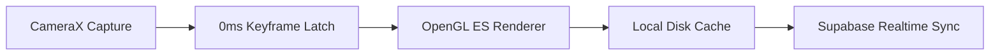

# 👋 Hey there, I'm Prathmesh!

### Senior Developer @ Finrein

  
  &nbsp;
  
  &nbsp;
  
  &nbsp;
  

---

## 💬 About Me

Welcome to my profile! I'm a **Senior Developer at Finrein**, where I lead native mobile development and core systems engineering. My day-to-day work revolves around solving complex technical problems—ranging from building zero-latency Android media applications to architecting real-time backend infrastructures.

I'm deeply driven by software craftsmanship: writing clean, modular code, reducing execution overhead, and designing user interfaces that feel immediate, fluid, and refined. When I'm not in Android Studio or working on database schemas, I enjoy exploring modern frontend web frameworks, distributed architectures, and developer tooling.

---

## 🎯 Areas of Expertise

- 📱 **Native Android Engineering**: Jetpack Compose (Material 3), Kotlin 2.0, CameraX, Google Media3 (`ExoPlayer`), Room, Hilt, MVVM & Clean Architecture.
- 🎬 **Low-Latency Media Processing**: Off-screen OpenGL ES 2.0 rendering, EGL surface pipelines, state-latched JPEG keyframes, and video transcoding.
- ☁️ **Full-Stack & Cloud Infrastructure**: PostgreSQL, Supabase PostgREST & WebSocket Realtime, Node.js, Python, TypeScript, React, Next.js, and Docker.

---

## 🛠️ Technology Stack

### Languages & Core

  

### Mobile & Systems

  

### Backend & Cloud

  

### Frontend Web

  

### Tools & Workspace

  

---

## 🚀 Key Project Architecture Spotlight

### 🎥 **PALZEE** — *Built at Finrein*
- **Private Micro-Vlogging & Group Media Engine** engineered for close friend circles.
- Features **0ms perceived transition latency** using keyframe JPEG state-latching while ExoPlayer mounts underneath.
- Powered by an **OpenGL ES 2.0 off-screen video encoder** for 9:16 slideshows with rounded corner shaders, dynamic text overlays, and audio track mixing.
- Built on a **local-first media pipeline** synchronized with Supabase PostgreSQL & WebSocket Realtime.

---

## 📫 Let's Connect

  
  &nbsp;&nbsp;
  
  &nbsp;&nbsp;
  
  &nbsp;&nbsp;
  

 

Designed with ❤️ by Prathmesh Upadhyay • Senior Developer @ Finrein

